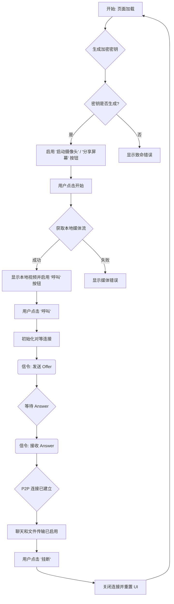
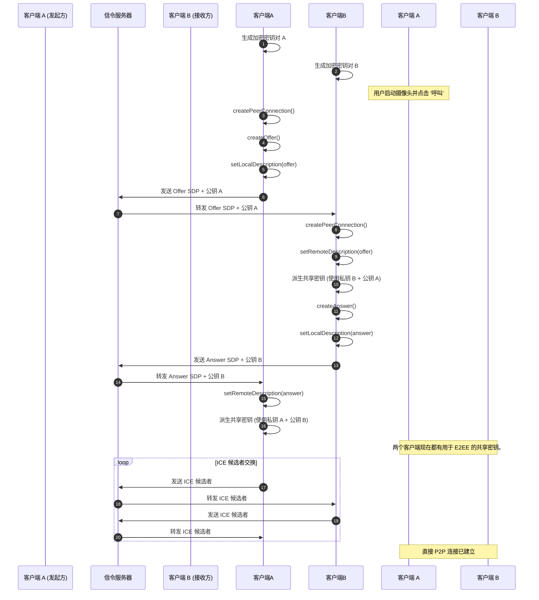
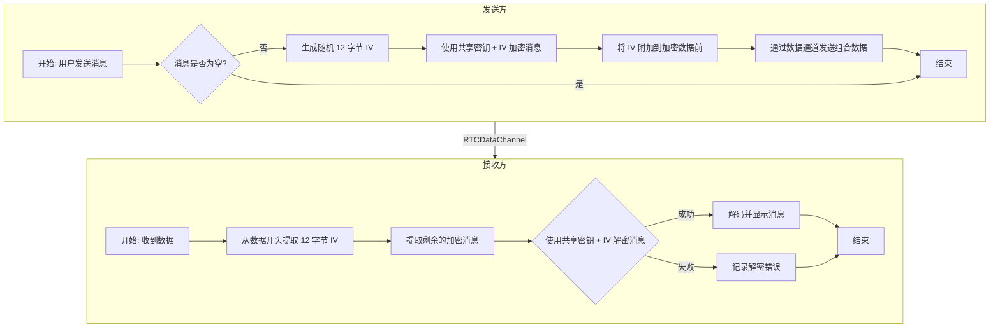

# WebRTC 示例图表

本文档包含图表，用于说明此 WebRTC 应用程序的架构和数据流。您可以在任何支持 Mermaid.js 的 Markdown 编辑器中查看这些图表。

---

## 1. 应用程序流程图

此流程图从用户角度展示了从加载页面到结束通话的常规事件序列。

---

## 2. 连接设置时序图

此图说明了建立对等连接所需的详细信令过程。它显示了两个客户端（发起方和接收方）以及信令服务器的角色。

---

## 3. 加密消息流程图

此图显示了在一个用户向另一个用户发送加密消息时所涉及的步骤（在连接建立后）。

